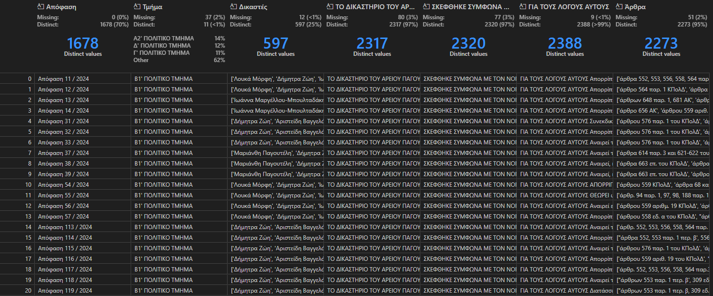
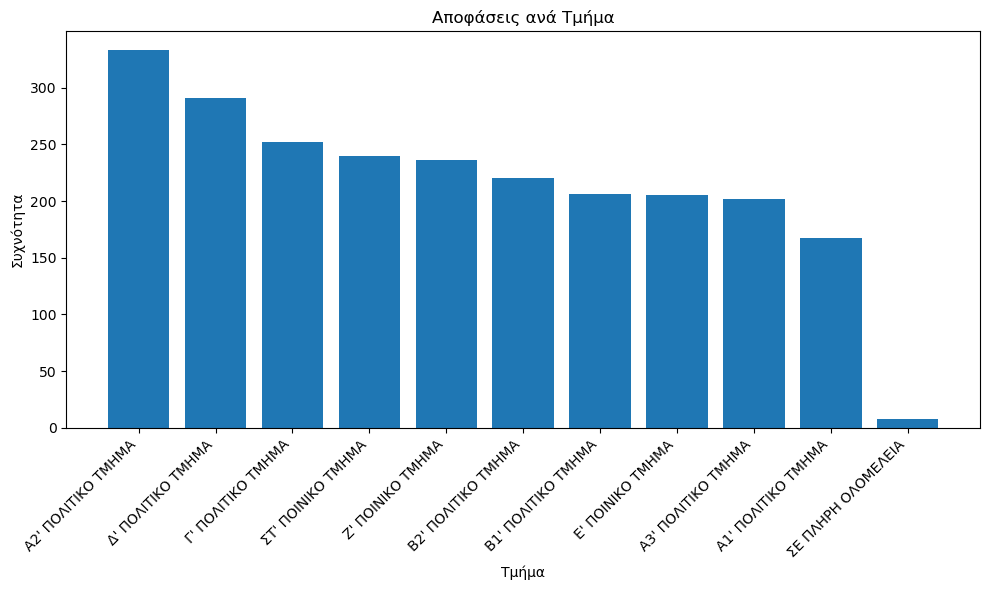
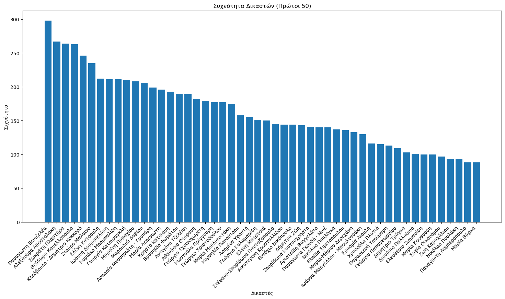
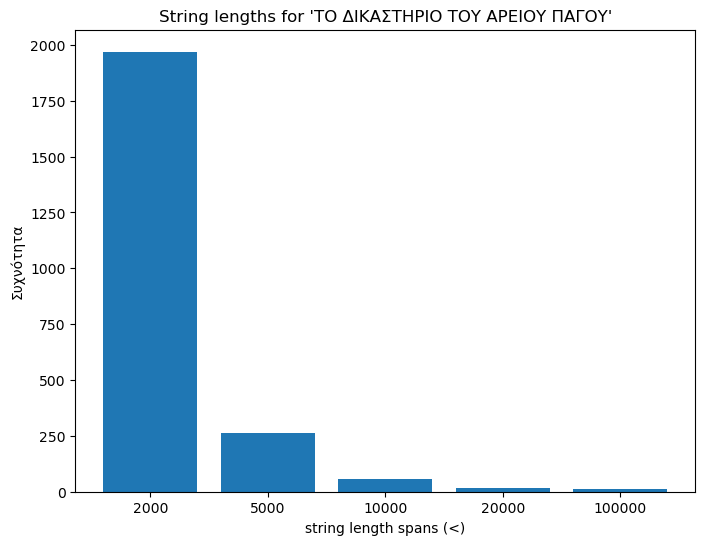
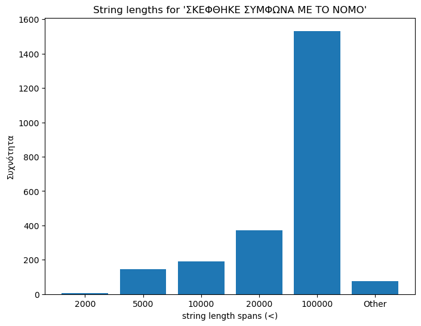
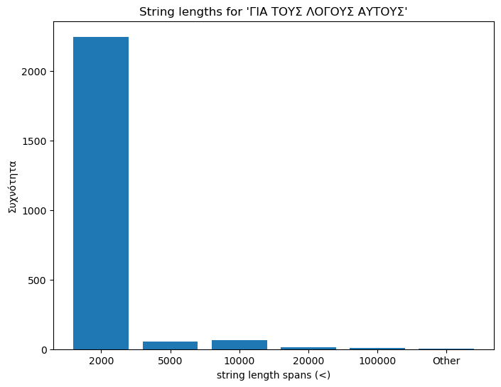
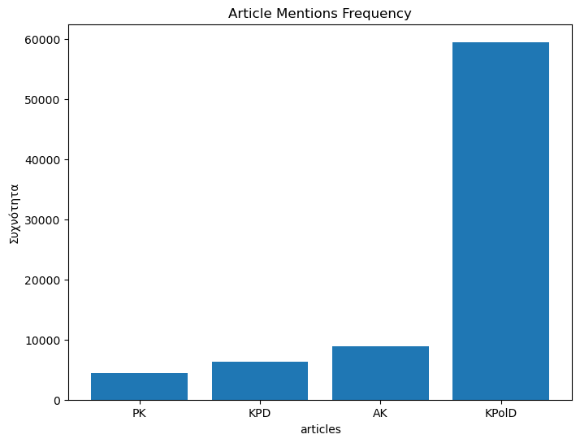

# AreiosPagosDataAnalysis

Phase 1: Web crawling all the decisions Areios Pagos made in the year 2024. This is the first project of the course _Εφαρμοσμένη Επιστήμη Δεδομένων - Department of Informatics AUEB 2024-2025_.
Phase 2: Training a clustering model. This is the second project of the course _Εφαρμοσμένη Επιστήμη Δεδομένων - Department of Informatics AUEB 2024-2025_.

## Phase 1 - Web Crawling

### Specifications

The specifications of the dataframe are the following:

1. **Απόφαση**: Number of decision
2. **Τμήμα**: Class and class number
3. **Δικαστές**: A list with the names of the judges that participated
4. **ΤΟ ΔΙΚΑΣΤΗΡΙΟ ΤΟΥ ΑΡΕΙΟΥ ΠΑΓΑΟΥ**: Intro
5. **ΣΚΕΦΘΗΚΕ ΣΥΜΦΩΝΑ ΜΕ ΤΟ ΝΟΜΟ**: Main body
6. **ΓΙΑ ΤΟΥΣ ΛΟΓΟΥΣ ΑΥΤΟΥΣ**: Decision / Outro
7. **Άρθρα**: A list with all the articles mentioned

 

_Sample of the resulting csv after the scraping_

### Statistics and Observations

#### Classes

| Τμήμα              | Αριθμός Υποθέσεων |
| ------------------ | ----------------- |
| Α2' ΠΟΛΙΤΙΚΟ TMHMA | 333               |
| Δ' ΠΟΛΙΤΙΚΟ TMHMA  | 291               |
| Γ' ΠΟΛΙΤΙΚΟ TMHMA  | 252               |
| ΣΤ' ΠΟΙΝΙΚΟ TMHMA  | 240               |
| Ζ' ΠΟΙΝΙΚΟ TMHMA   | 236               |
| Β2' ΠΟΛΙΤΙΚΟ TMHMA | 220               |
| Β1' ΠΟΛΙΤΙΚΟ TMHMA | 206               |
| Ε' ΠΟΙΝΙΚΟ TMHMA   | 205               |
| Α3' ΠΟΛΙΤΙΚΟ TMHMA | 202               |
| Α1' ΠΟΛΙΤΙΚΟ TMHMA | 167               |
| ΣΕ ΠΛΗΡΗ ΟΛΟΜΕΛΕΙΑ | 8                 |

#### Judges

| Δικαστής                                  | Αριθμός Υποθέσεων |
| ----------------------------------------- | ----------------- |
| Παναγιώτη Βενιζελέα                       | 298               |
| Αλεξάνδρα Αποστολάκη                      | 267               |
| Σωκράτη Πλαστήρα                          | 264               |
| Θεόδωρο Κανελλόπουλο                      | 263               |
| Κλεόβουλο - Δημήτριο Κοκκορό              | 246               |
| ...                                       |                   |
| Παναγιώτα Πασσίση - Εισηγήτρια            | 1                 |
| Στέφανο-Σπυρίδων Πανταζόπουλο - Εισηγητή  | 1                 |
| Στέφανο-Σπυρίδωνα Πανταζόπουλο - Εισηγητή | 1                 |
| Χρήστο Κατσιάνη - Εισηγητή                | 1                 |
| Δέσποινα Βασιλοδημητράκη - Εισηγήτρια     | 1                 |

There are a total of 363 judges. In the diagram below the 50 most frequent appear.

#### Text

For the text we decided to compare how many words each article is. In the diagrams below we can see the max-amount of words on the x-axis (0-2000 words, 2000-5000 words, etc.) and on the y-axis the frequency of each category.

<table style="width: 100%;">
  <tr>
    <td style="width: 33.33%; text-align: center;">
      
    </td>
    <td style="width: 33.33%; text-align: center;">
      
    </td>
    <td style="width: 33.33%; text-align: center;">
      
    </td>
  </tr>
</table>

#### Articles

For the articles we gathered all their appearences on the whole dataframe and counted the frequency of their occurance. There are 4 classes of articles: "ΠΚ" and "ΚΠΔ" for Criminal articles and "ΑΚ" and "ΚΠολΔ" for Political articles.

